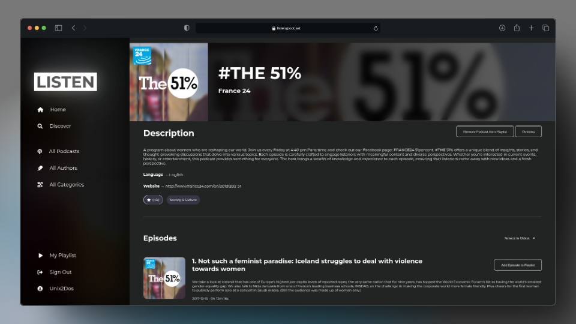

<br>


A sleek, minimalist podcast app that combines powerful features with a clean, intuitive design. Discover and enjoy your favorite podcasts effortlessly, all in a beautifully streamlined interface.



## Features

- 🎨 **Minimalist Design** — Clean and intuitive interface with dynamic themes that adapt to podcast covers.
- 🔍 **Podcast Discovery** — Browse, filter, and search for podcasts across categories.
- 📋 **Detailed Podcast View** — Episode lists, descriptions, and related content.
- 👤 **User Accounts** — Login, signup, guest browsing, and personalized playlists.
- 🎧 **Dynamic UI** — Theming that adapts based on podcast artwork for a seamless visual experience.

## Install & Execute

1. Clone this repository
2.
```shell
$ cd Listen
$ py -3 -m venv venv

# on windows:
$ venv\Scripts\activate
# on macos/linux:
$ source venv/bin/activate

$ pip install -r requirements.txt
$ flask run
```

## Future Plans

- **Listen Wrapped** — Personalized end-of-year listening stats

## Data sources

The data files are modified excerpts downloaded from:

https://www.kaggle.com/code/switkowski/building-a-podcast-recommendation-engine/input

## Contributors

- **Vandan Bhatt**
- **Deiza Talreja**
- **Thamasha Rajakaruna**

If you'd like to contribute to this project, feel free to fork the repository and submit a pull request with your improvements.