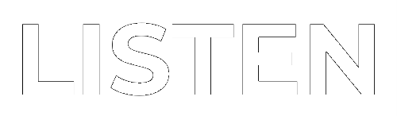

<br>



A sleek, minimalist podcast app that combines powerful features with a clean, intuitive design. Discover and enjoy your favorite podcasts effortlessly, all in a beautifully streamlined interface.

## Table of Contents
1. [Installation](#installation)
2. [Execution](#execution)
3. [Testing](#testing)
4. [Configuration](#configuration)
5. [Endpoints](#endpoints)
6. [Features](#features)
7. [Design Decisions](#design-decisions)
8. [Data Sources](#data-sources)
9. [Contributors](#contributors)

## Installation

1. Clone this repository

**Windows**
```shell
$ cd <project directory>
$ py -3 -m venv venv
$ venv\Scripts\activate
$ pip install -r requirements.txt
```

**MacOS**
```shell
$ cd <project directory>
$ python3 -m venv venv
$ source venv/bin/activate
$ pip install -r requirements.txt
```

When using PyCharm, set the virtual environment using 'File or PyCharm'->'Settings' and select your project from the left menu. Select 'Project Interpreter', click on the gearwheel button and select 'Add Interpreter'. Click the 'Existing environment' radio button to select the virtual environment. 

## Execution

**Running the application**

From the *project directory*, and within the activated virtual environment (see *venv\Scripts\activate* above):

````shell
$ flask run
```` 

## Testing

After you have configured pytest as the testing tool for PyCharm (File - Settings - Tools - Python Integrated Tools - Testing), you can then run tests from within PyCharm by right-clicking the tests folder and selecting "Run pytest in tests".

Alternatively, from a terminal in the root folder of the project, you can also call 'python -m pytest tests' to run all the tests. PyCharm also provides a built-in terminal, which uses the configured virtual environment. 

## Configuration

The *project directory/.env* file contains variable settings. They are set with appropriate values.

* `FLASK_APP`: Entry point of the application (should always be `wsgi.py`).
* `FLASK_ENV`: The environment in which to run the application (either `development` or `production`).
* `SECRET_KEY`: Secret key used to encrypt session data.
* `TESTING`: Set to False for running the application. Overridden and set to True automatically when testing the application.
* `WTF_CSRF_SECRET_KEY`: Secret key used by the WTForm library.
 
## Endpoints

Here are the primary endpoints for the application:

* **GET /**: Homepage of the application.
* **GET /<facet_name>**: Displays the home page with podcasts filtered by the specified facet (e.g., top podcasts, recently played, or new podcasts).
* **GET /home/<podcast_id>**: Redirects to the detailed description page of the selected podcast.
* **GET /category**: Displays a list of all podcast categories. (page for categories)
* **GET /category/<category_name>**: Redirects to the page displaying podcasts within the specified category.
* **GET /discover**: Displays the Discover(Catalogue) page with popular categories, editor picks, and a podcast list with a filter functionality (ex: By newest to oldest).
* **GET /all_podcasts/<category_name>**: Shows podcasts under a specific category or all podcasts if the category is "all".
* **GET /editor_picks/<podcast_id>**: Redirects to the detailed description page of a podcast selected as an editor's pick.
* **GET /filtered_podcast/<podcast_id>**: Redirects to the detailed description page of a podcast after applying some filter and clicking a podcast.
* **GET /podcast**: Displays detailed information about a specific podcast, including its description, categories, and episodes.

## Features

- **Minimalist Design:** A clean and intuitive interface that makes it easy to navigate through your favorite podcasts.
- **Podcast Discovery:** Browse and search for podcasts based on various categories and recommendations.
- **Detailed Podcast View:** View detailed information about each podcast, including episodes, descriptions, and related content.

## Design Decisions

Any important design decisions go here!

## Data sources

The data files are modified excerpts downloaded from:

https://www.kaggle.com/code/switkowski/building-a-podcast-recommendation-engine/input

## Contributors

- **Deiza Talreja**
- **Thamasha Rajakaruna**
- **Vandan Bhatt**

If you'd like to contribute to this project, feel free to fork the repository and submit a pull request with your improvements.